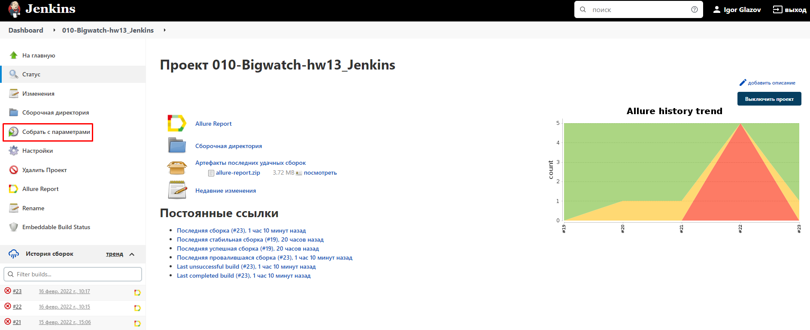
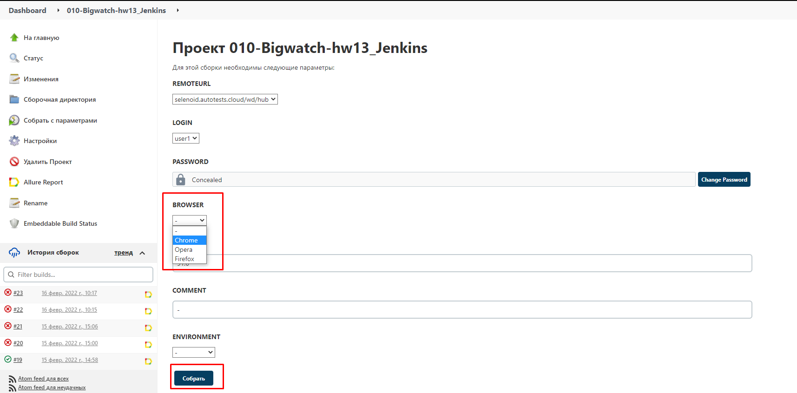
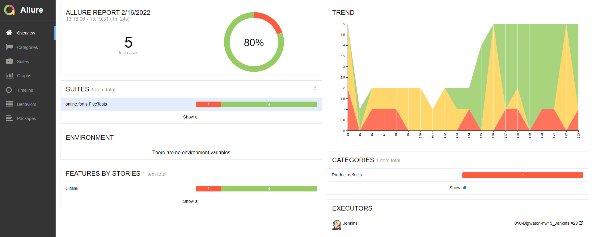
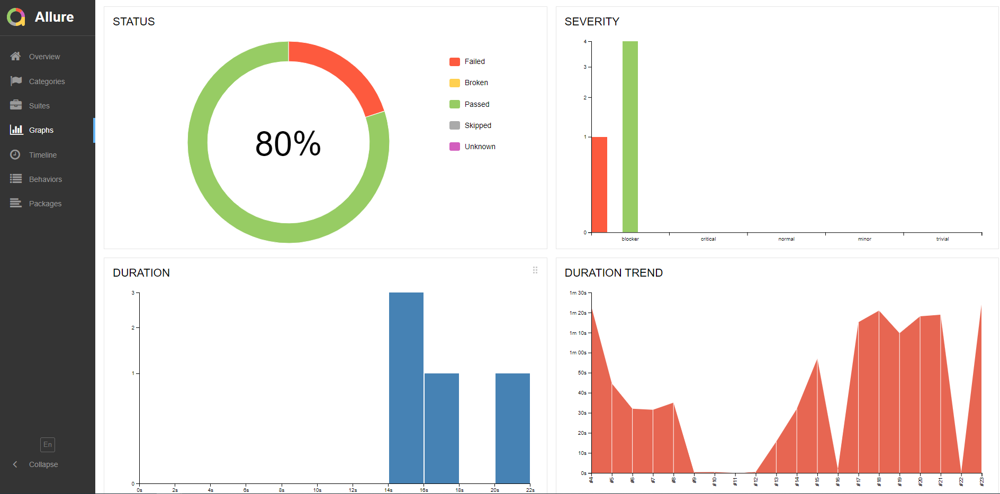
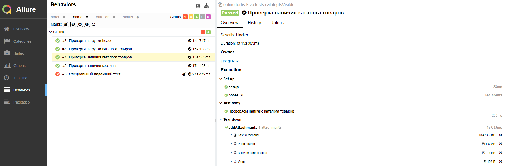
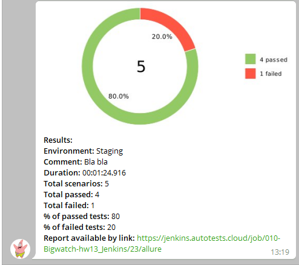
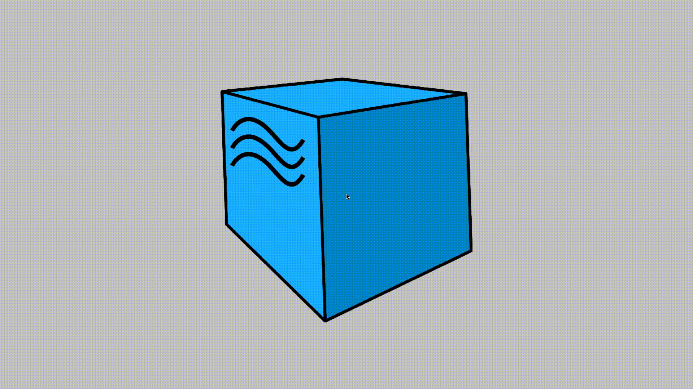

<h1>Проект по тестированию главной страницы интернет-магазина "Ситилинк"</h1>

<a target="_blank" href="https://www.citilink.ru/">Ссылка на сайт магазина</a>

<h2>:bookmark_tabs: Содержание</h2>

:eight_spoked_asterisk:	 Стек технологий

:eight_spoked_asterisk:	 Запуск тестов в Jenkins

:eight_spoked_asterisk:	 Отчет о результатах прохождения тестов в Allure TestOps

:eight_spoked_asterisk:	 Уведомления в Telegram с использованием бота

:eight_spoked_asterisk:	 Пример запуска теста в Selenoid


<h2>:books:	 Стек технологий</h2>


<p>
 


 
</p>


<h2>:arrow_forward:	 Запуск тестов в Jenkins</h2>
<p>Для запуска тестов используется инструмент CI/CD под названием <b>Jenkins</b></p>

```
clean
test
-Dbrowser=${BROWSER}
-Dversion=${VERSION}
-DremoteUrl=${REMOTEURL}
-Dlogin=${LOGIN}
-Dpassword=${PASSWORD}
```
<p><code>BROWSER</code> – браузер, в котором будут выполняться тесты.</p>
<p><code>VERSION</code> – версия браузера, в которой будут выполняться тесты.</p>
<p><code>REMOTE_URL</code> – адрес удаленного сервера, на котором будут запускаться тесты.</p>
<p><code>LOGIN</code> - логин для авторизации на удалённом сервере.</p>
<p><code>PASSWORD</code> - пароль для авторизации на удалённом сервере.</p>

<h3>:large_blue_diamond:	 Процесс запуска происходит следующим образом:</h3>

<p><i>На странице сборки выбираем <b>"Собрать с параметрами"</b>: </i>
</br>
</br>

</p>

<p><i>Выбираем необходимые параметры запуска и нажимаем <b>"Собрать"</b>: </i>
</br>
</br>

</p>

<h2>:bar_chart:	 Отчет о результатах прохождения тестов в Allure TestOps</h2>

<h3>:large_orange_diamond:	 Страница с обобщёнными данными по отчёту:</h3>

<p align="center">

</p>

<h3>:large_orange_diamond:	 Страница с графической информацией:</h3>

<p align="center">

</p>

<h3>:large_orange_diamond:	 Страница с описанием шагов теста:</h3>

<p align="center">

</p>


<h2>:mailbox_with_mail:	 Уведомления в Telegram с использованием бота</h2>
<p><i>После окончания сборки в Телеграм отправляется уведомление со ссылкой на отчёт. </i>
</br>
</br>

</p>


<h2>:cinema:	 Пример запуска теста в Selenoid</h2>
<p><i>К каждому тесту в отчете прилагается видео: </i>
</br>
</br>

</p>


